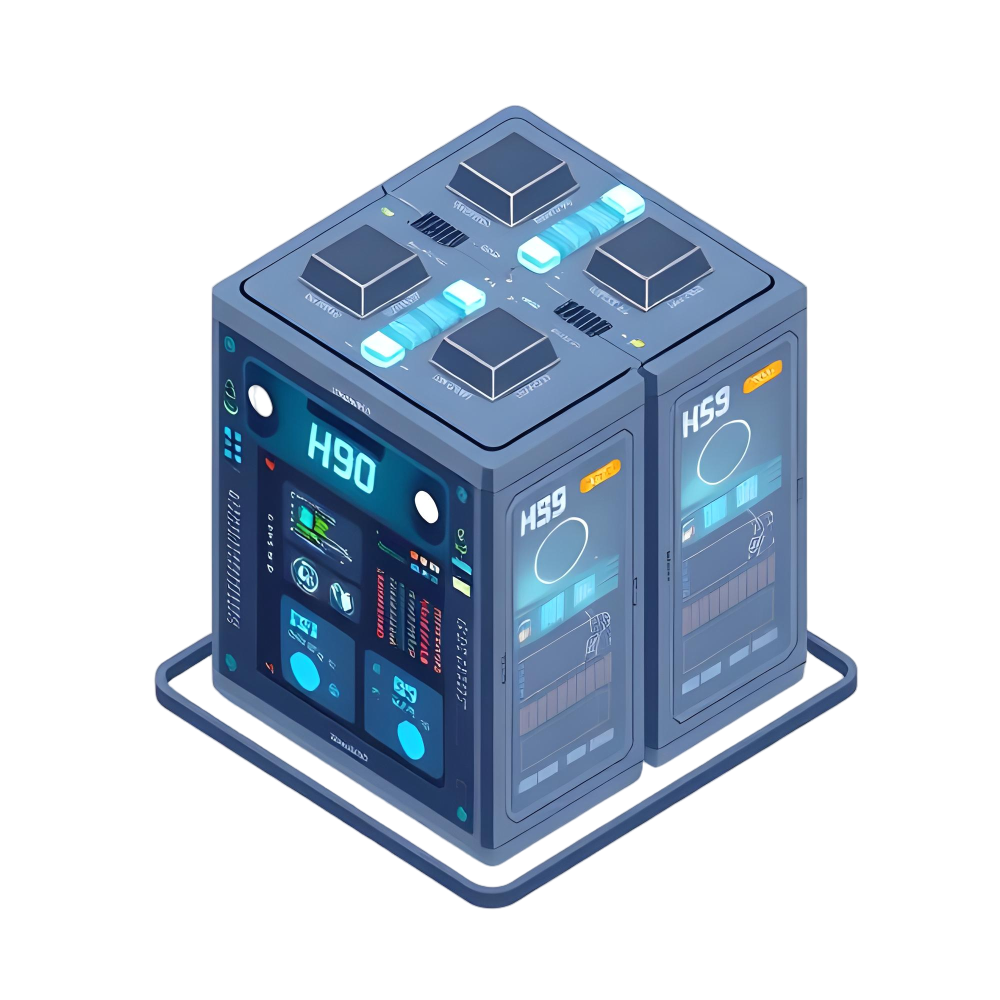

 

 # Large-scale Deep Learning with High-Performance Comptuing for Earth Observation

This repository hosts the support material of the „*Large-Scale Deep Learning with HPC for Earth Observation*“ mini-course offered by the University of Iceland as part of the 2025 [Blended Intensive Program](https://internazionale.unipv.eu/it/machine-learning-for-earth-observation-and-data-fusion/) online segment.

Check the full programme here 👉 [https://go.fzj.de/bip-ml-for-eo-and-data-fusion](https://go.fzj.de/bip-ml-for-eo-and-data-fusion)

## Content

The mini-course consits of 
- an introduction lecture by [Prof. Dr. -Ing. Gabriele Cavallaro](https://www.gabriele-cavallaro.com/)
- two guided hands-on tutorials
- a facilitated self-learning session

Join the BIP compute project here 👉 [https://judoor.fz-juelich.de/projects/join/training2504](https://judoor.fz-juelich.de/projects/join/training2504)

| Unit | Topic                          | Description                                                                 |
|------|--------------------------------|-----------------------------------------------------------------------------|
| 0    | [High-Performance Computing for Earth Observation](https://github.com/stemauro/bip-course) | Introduction to High-Performance Computing (HPC) for large-scale EO applications.                  |
| 1    | [Systems & Infrastructure at the Jülich Supercomputing Centre](https://github.com/stemauro/bip-course)       |  Interactive HPC environments setup with Jupyter-JSC.          |
| 2   | [Distributed Deep Learning](https://github.com/stemauro/bip-course)       |  Distributed Deep Learning on GPU-based clusters. |
| 3    | [Geospatial Foundation Models Finetuning](https://github.com/stemauro/bip-course)                     | Large-Scale Geospatial Foundation Models finetuing on student's dataset               |

### Ongoing activities

### Work on existing units

Collection of the support material for the course is still at its early stages. The following list of activities is going to be updated as more resources are created.

| Unit | Status        | Contributions                                                          |
|------|--------------|------------------------------------------------------------------------|
| 0    | 🗓️ Planned     | Slides to be compiled and provided. |
| 1    | 🚧 In Progress | Environment configuration scripts from existing projects currently under refinement. |
| 2    | 🗓️ Planned | Content to be discussed with Gabriele. |
| 3    | 🗓️ Planned    | Content to be discussed with Gabriele. |