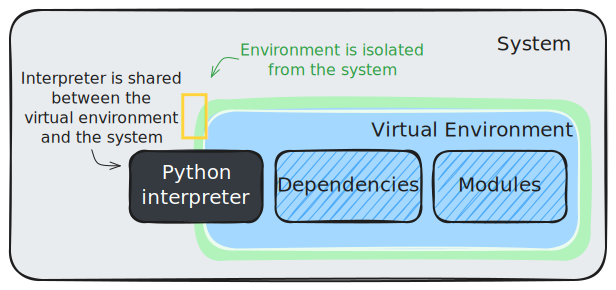

# Environment setup on clusters

## TL;DR

A virtual environment is an isolated workspace that ensures safe use of project-specific Python dependencies, reducing conflicts with Python packages installed system-wide. Therefore, such environments are crutial for healthy code development on the JSC 🚀supercomputers. To operate a virtual environment, start a Jupyter-JSC session on *JURECA*, under the *training2504* compute project, and run the following instructions

```shell
cd $HOME
cp $PROJECT_training2504/shared/config_symlinks.sh $HOME
bash ./config_symlinks.sh
git clone https://github.com/stemauro/bip-course.git bip && cd $HOME/bip-course/bip
bash scripts/setup.sh && bash scripts/kernel.sh
```

## What is a virtual environment

A virtual environment is a special folder on your computer where you can keep a separate copy of Python and any extra packages your project needs. This way, you don’t have to worry about messing up the main Python installation on your computer or causing problems with other projects. It helps you avoid conflicts between different versions of packages and makes it easier to share and repeat your work. It’s called “virtual” because it works alongside your main Python setup but doesn’t change anything outside its own folder.

<div align="center">
    
</div>

A beginner friendly introduction to Python virtual environments can be found at [this blog post](https://towardsdatascience.com/python-virtual-environments-why-and-when-should-you-use-them-be57b0c0323d/).

>[!TIP]
> Virtual environments have been historically managed through `venv`, which now ships with all modern Python versions. Along the years, more powerful and flexible alternatives to have gained traction within the Python community, such as `pyenv` and `uv`.  

## Why is a virtual environment needed

Creating an environment on a supercomputer can be a bit tricky, but you can automate the process using simple bash scripts. For this project, these scripts are already provided as part of the support material. You don’t need to change these scripts yourself, but you’re welcome to look at them if you want to learn more about how everything works behind the scenes.

>[!WARNING]
>In order to follow the steps below,users are expected to posses an active JuDoor account and some working credentials to access the Jupyter-JSC service.
<!-- If that is not the case, please check out how to create a user account at [this page](somelink). -->

## Set-up guidelines

The following steps are necessary to create a working virtual environment on the JSC 🚀supercomputers.

### Step 1: Start a Jupyter-JSC session

Log in to Jupyter-JSC and create a new notebook following the configuration below. As the cluster system being used on this tutorial is *JURECA*, you should be able to select it as an entry within the *System* drop-down menu. Also, select *training2504* as a project.


### Step 2: Configure folder structures and links

When you use a 🚀supercomputer, you also need to keep track of your resources, especially how much disk space you’re using in your personal folder and in shared storage areas. To help with this, a handy script is provided in the shared project folder that takes care of the setup for you. Just copy this script into your home directory by using the following command:

```shell
cd $HOME
cp $PROJECT_training2504/shared/config_symlinks.sh $HOME
```

Then run the script from your user's home directory:

```shell
cd $HOME
bash ./config_symlinks.sh
```

If the scripts ran correctly, the output of the `tree` command on the user's home directory should read as:

```shell
$ tree -l -L 2 $HOME
/p/home/jusers/your-username/jureca
├── bip-course -> /p/project1/training2504/your-username
├── config_symlinks.sh
├── data -> /p/scratch/training2504/your-username
└── shared -> ../shared
    └── pytorch-at-jsc
```

### Step 3: Clone the course repository

The course support material is available at [this URL](https://github.com/stemauro/bip-course). The following instructions download (i.e., clone) the course repository from GitHub to the user's home directory, under the `bip-course` folder.

```shell
cd $HOME/bip-course
git clone https://github.com/stemauro/bip-course.git bip
```

Then the content on the `$HOME/bip-course` directory should look the following:

```shell
$ tree -l -L 2 $HOME
/p/home/jusers/your-username/jureca
├── bip-course -> /p/project1/training2504/your-username
│   └── bip
├── config_symlinks.sh
├── data -> /p/scratch/training2504/your-username
└── shared -> ../shared
    └── pytorch-at-jsc
```

### Step 4: Install the environment

As previously mentioned, the support material already contains a handful of convenient scripts to install, activate and tune virtual environments on the JSC 🚀supercomputers. The following commands perform a fresh environment installation:

```shell
cd $HOME/bip-course/bip
bash scripts/setup.sh
```

The `setup.sh` script will load the necessary modules and download external dependencies into an virtual environment called after the repository name (i.e., `bip`).

### Quick check: Activate the environment

Once an environment has been succesfully set up, it can be activated through the following commands:

```shell
cd $HOME/bip-course/bip
source scripts/activate.sh
```

> [!WARNING]
> Please note that, differently from the setup script which is launched using the `bash` command, the activation script needs to be run using the `source` command. Calling `bash scripts/activate.sh` won't work as intended.

To exit from an active virtual environment run:

```shell
deactivate
```

### Step 5: Create a Jupyter kernel

A Jupyter kernel is a background process which runs Python code from a Jupyter notebook. Therefore, a kernel must be paired with a virtual environment for a notebook to use packages installed within that environment.
Once an environment is set up and activable, a Jupyter kernel bound to it can be created by running:

```shell
cd $HOME/bip-course/bip
bash scripts/kernel.sh
```

Further information on Jupyer kernels can be found on [this blog post](https://hex.tech/blog/jupyter-kernel-overview/).

## Conclusion

By following the above steps, you have correctly configured a virtual environment on the JSC 🚀supercomputers. This will allow you to develop danger-free of messing with system-wide packages while making your code easier to distribute. As a final test, you may want to check that your folder structure looks similar to this:

 ```shell
$ tree -l -L 2 $HOME
/p/home/jusers/your-username/jureca
├── bip-course -> /p/project1/training2504/your-username
│   ├── bip
│   └── jupyter
├── config_symlinks.sh
├── data -> /p/scratch/training2504/your-username
└── shared -> ../shared
    └── pytorch-at-jsc
```

If so, you are ready to dive into the [first notebook](../../../notebooks/preprocessing.ipynb) 🚀.
